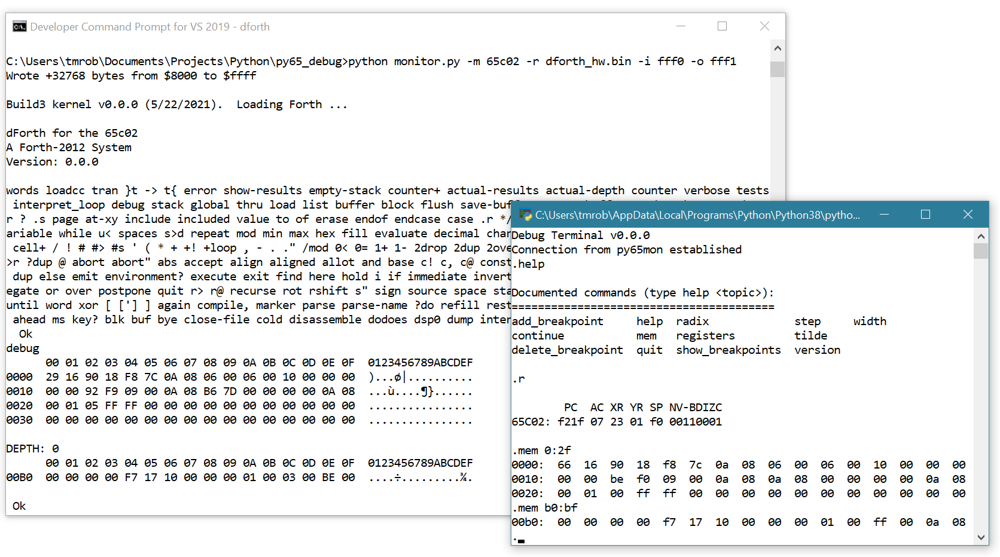

# Add a separate debug window to py65
Py65 (https://github.com/mnaberez/py65) is a great simulator for the 6502.  One thing I've wished for is a separate debug window so your program's console isn't affected by the py65 I/O.  After my success in modifying py65 for interrupts (https://github.com/tmr4/py65_int) I decided to try adding this feature. Luckily, py65 is open-source andenhancing it isn't very difficult.

This repository provides a framework for adding a debug window to py65.  I've included sample routines for adding a debug window to my build, which includes the interrupt modifications linked above.  While not required, I use the VIA interrupt routine to open the debug window with a `<ESC>Q` or `<ESC>q`.  You'll need to modify that if you're not using the interrupt modifications.  As noted below, a few modifications need to be made to core py65 modules as well.

# Screenshot



# Contents

This builds on my interrupt modifications (https://github.com/tmr4/py65_int).  You'll need to start there to add a debug window (if there is interest I could provide a fork to py65 with these modes and a binary of my 6502 code for testing).  I've added two modules, db_server and db_client, to add a debug window to py65.  I've also include two modified interrupt based files, `interrupts.py` and `via65c02.py` as noted.  These assume you'll use the modules to handle interrupts.  These work for my build.  They should give you an idea for writing code for your own build.  Note that I'm a Python newbie and appreciate any feedback to make these better.

* `db_server.py`

Provides an interface between the debug window and the py65 monitor.

* `db_client.py`

The debug window.

* `interrupts.py`

Modified to provide a reference to the VIA.
  
* `via65c02.py`

Modified to capture `<ESC>D` or `<ESC>d` to open the debug window and add state flags.

# Modifications to core py65 modules

I've tried to minimize the changes to the core py65 modules.  The following modifications are needed for py65 to handle the interrupts above:

1. `monitor.py`

* Add a reference to db_server class `from db_server import db_server as server`
* Create a new instance of the db_server class with `self.s = server(self, self._mpu, self.interrupts)` at the end of the `_reset` method.
* Replace the contents of the `_run` method with `self.s.do_db(stopcodes, self._breakpoints)`.  You may need to leave in the calls to `console.noncanonical_mode` and `console.restore_mode` in non-Windows systems.

# License

The db_client.py module closely mirrors the functionality of the py65 monitor and I've used/modified a good portion of the code from the monitor.py module from py65 which is covered by a BSD 3-Clause License.  I've included that license.

# Differences / Limitations

The debug window has the following limitations:

* The following py65 commands are not available in the debug window: 
````
save            show_labels
add_label       delete_label       load
assemble        disassemble        
cd              fill               mpu   reset
cycles          goto               pwd   return
````

To use these commands you'll need to break to the monitor with `<ESC>q` in the main window after closing the debug window (you cannot do this while the debug window is open).  These commands could be added to the debug window, but I've left them out as I don't use them.

* The debug window does not print a register summary after every command.

* The default width in the debug window is 72.

* Providing a number of a radix different than the default as an argument in a command may cause problems if not properly prefixed.  For example `mem 0:2f` will crash the debug window if the default radix is decimal.  In this case you need to use the proper prefix, `mem 0:$2f`.  Note that this problem originates in the py65 address parser.  If I track down the cause I may submit the issue to the py65 team.
